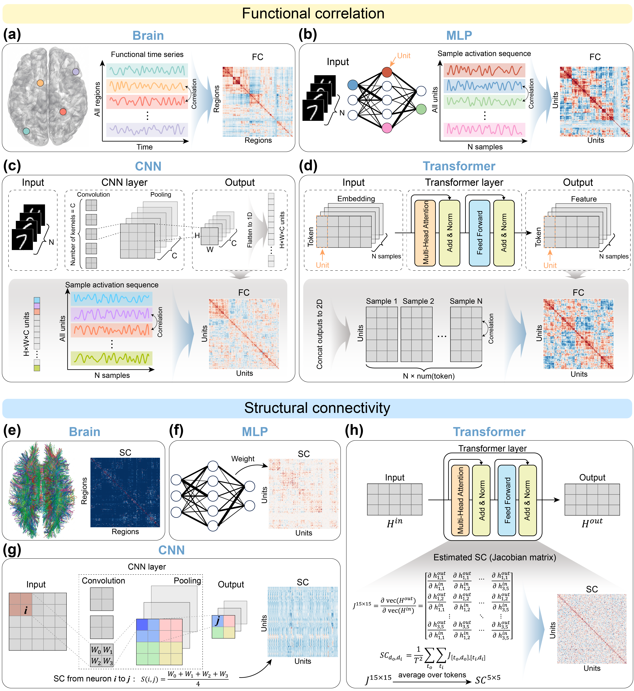

# Early functional correlation facilitates learning in artificial neural networks

This repository contains the analysis and source-figure generation code accompanying the manuscript **“Early functional correlation facilitates learning in artificial neural networks.”**

The code examines functional correlation (FC), structural connectivity (SC) and structural input similarity (IS) in multilayer perceptrons, convolutional neural networks, transformers and biological neural networks. It includes analyses corresponding to main Figs. 1–6 and Extended Data Figs. 1–8.

## Connectomic framework



Figure 1 presents unified operational definitions of FC and SC across biological brain networks, multilayer perceptrons, convolutional neural networks and transformers. FC is calculated from correlations between regional or unit activity profiles, whereas SC is represented by anatomical connectivity, learned weights, convolutional-kernel-derived connections or Jacobian-estimated effective connectivity, depending on the system.

## Repository structure

- `experiments/`: analyses for the main figures and associated Extended Data figures
- `supplementary/`: additional robustness and validation analyses
- `requirements/`: dependency files for different experiment families
- [`docs/FIGURE_CODE_MAP.md`](docs/FIGURE_CODE_MAP.md): figure-to-code correspondence

## Getting started

For the common MLP, CNN and cross-system analyses:

```bash
python -m venv .venv
python -m pip install -r requirements/core.txt
jupyter lab
```

Transformer architecture, mixture-of-experts and pruning experiments require separate environments. See [`requirements/README.md`](requirements/README.md).

## Data

Standard machine-learning datasets are downloaded or prepared as described in the corresponding notebooks. Biological datasets should be obtained from their original repositories, as specified in the manuscript.

Generated FC, SC and IS matrices are available at:

https://drive.google.com/drive/folders/1H7QlQPQx330HigOpmPvDC03w2Jf4At4u
